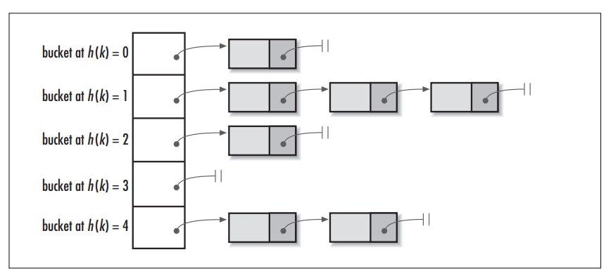

# 一、HashMap HashTable不同点
+ 1.**线程安全：** HashTable中的方法时同步的，HashMap在默认情况下是非同步的。  
+ 2.**继承关系：** HashTable继承自Dictionary。HashMap继承自AbstractMap接口。
+ 3.**允不允许null值：** HashTable中的key value都不允许出现null。HashMap允许null为键值
+ 4.**初始容量与扩充机制：** HashTable中hash数组初始大小是11，以2*old+1方式进行增加。HashMap中默认大小为16，并且以2倍方式进行增加。
+ 5.**哈希值不同：** HashTable直接使用对象的hashCode，HashMap重新计算对象的哈希值
+ 6.**遍历方式：** HashTable、HashMap都支持了Iterator遍历，且HashTable还是用了Enumeration的方式。 HashMap 实现 Iterator，支持fast-fail，Hashtable的 Iterator 遍历支持fast-fail，用 Enumeration 不支持 fast-fail

# 二、HashMap与ConcurrentHashMap的区别
ConcurrentHashMap基于代码块的同步，HashMap没有锁，不是线程安全的。
# 三、hash()分析
哈希将任意长度的输入，经过散列算法，变换成固定长度的输出，该输出就是散列值。哈希是一种压缩映射，将大的输入空间转换成短的输出空间。也就是相同哈希值，输入值可能是不同的。但不同的哈希值，输入肯定是不同的。**不同的输入计算得到相同的哈希值称为哈希碰撞**
+ 1.HashMap数据结构  
数组加链表形式(和C++ unorderedMap一致，侯捷老师早已看穿了一切~)。插个图：  

通过数组加链表的形式，把哈希后的对象进行存放  

**JDK1.7**  
### **HashMap:**
```
final int hash(Object k) {
    int h = hashSeed;
    if (0 != h && k instanceof String) {
        return sun.misc.Hashing.stringHash32((String) k);
    }

    h ^= k.hashCode();
    h ^= (h >>> 20) ^ (h >>> 12);
    return h ^ (h >>> 7) ^ (h >>> 4);
}

static int indexFor(int h, int length) {
    return h & (length-1);
}
```
其中indexFor方法主要是将hash生成的整型转换成链表数组中下标,其中return h&(length-1);就是将得到的哈希h对数组链表中数组的长度取模。位运算可以提高运算速度。其中的原理：  
```
X % 2^n = X & (2^n – 1)

2^n表示2的n次方，也就是说，一个数对2^n取模 == 一个数和(2^n – 1)做按位与运算 。

假设n为3，则2^3 = 8，表示成2进制就是1000。2^3 -1 = 7 ，即0111。

此时X & (2^3 – 1) 就相当于取X的2进制的最后三位数。

从2进制角度来看，X / 8相当于 X >> 3，即把X右移3位，此时得到了X / 8的商，而被移掉的部分(后三位)，则是X % 8，也就是余数。
```

***这里加点个人理解:若x是偶数，x/8，就相当于将n的二进制位向右移动3位，而x%8的余数也就是最右边移除的3位数。这里也就相当于将x和(8-1)的二进制进行与运算。这里将8换位 16、32、64...同理。***  
为降低哈希冲突的概率，hash()函数中把高位低位特征都考虑进来。 

### **HashTable**
HashTable中的hash方法：
```
private int hash(Object k) {
    // hashSeed will be zero if alternative hashing is disabled.
    return hashSeed ^ k.hashCode();
}
```
这里只是对哈希值，去了hashcode,同时取下标变为取模值：` int index = (hash & 0x7FFFFFFF) % tab.length;`
>为啥要把hash值和0x7FFFFFFF做一次按位与操作呢，主要是为了保证得到的index的第一位为0，也就是为了得到一个正数。因为有符号数第一位0代表正数，1代表负数。

***HashTable直接取模的原因：***
>HashTable默认的初始大小为11，之后每次扩充为原来的2n+1。   
>也就是说，HashTable的链表数组的默认大小是一个素数、奇数。之后的每次扩充结果也都是奇数。
>由于HashTable会尽量使用素数、奇数作为容量的大小。当哈希表的大小为素数时，简单的取模哈希的结果会更加均匀。（这个是可以证明出来的，由于不是本文重点，暂不详细介绍，可参考：http://zhaox.github.io/algorithm/2015/06/29/hash）

**总结：**
> + HashMap默认的初始化大小为16，之后每次扩充为原来的2倍。
> + HashTable默认的初始大小为11，之后每次扩充为原来的2n+1。
> + 当哈希表的大小为素数时，简单的取模哈希的结果会更加均匀，所以单从这一点上看，HashTable的哈希表大小选择，似乎更高明些。因为hash结果越分散效果越好。
> + 在取模计算时，如果模数是2的幂，那么我们可以直接使用位运算来得到结果，效率要大大高于做除法。所以从hash计算的效率上，又是HashMap更胜一筹。
> + 但是，HashMap为了提高效率使用位运算代替哈希，这又引入了哈希分布不均匀的问题，所以HashMap为解决这问题，又对hash算法做了一些改进，进行了扰动计算。

**JDK8**  
java8中，将数组链表结构中，链表换成了红黑树，之前的链表结构可能会出现O(n)的复杂度，如此一搞，最高复杂度变为O(logn)。纯链表结构可能会被发送大量相同的值，造成程序忙于进行链表的索引查找，造成Dos攻击。
```
static final int hash(Object key) {
    int h;
    return (key == null) ? 0 : (h = key.hashCode()) ^ (h >>> 16);
}
```

# 四、capacity size loadFactor threshold解释
+ capacity为hashmap或table中的容量的大小，size是当前已经装的对象个数
+ 其中HashMap默认大小为16，若在初始化进行指定则会存在一下规律(1-1,7-8,9-16)，即找大于的2^n
+ loadFactor为装载因子，即当其中对象个数大于等于 `threshold = loadFactor*capacity`时候，会进行扩充，，其中loadFactor默认大小为0.75f,threshold默认大小为 `0.75*16=12`进行扩充。
+ 默认大小为16的capacity是一个经验值，考虑到。同时loadFactor0.75 是因为太大会造成哈希冲突，太小又会降低了空间的利用率
